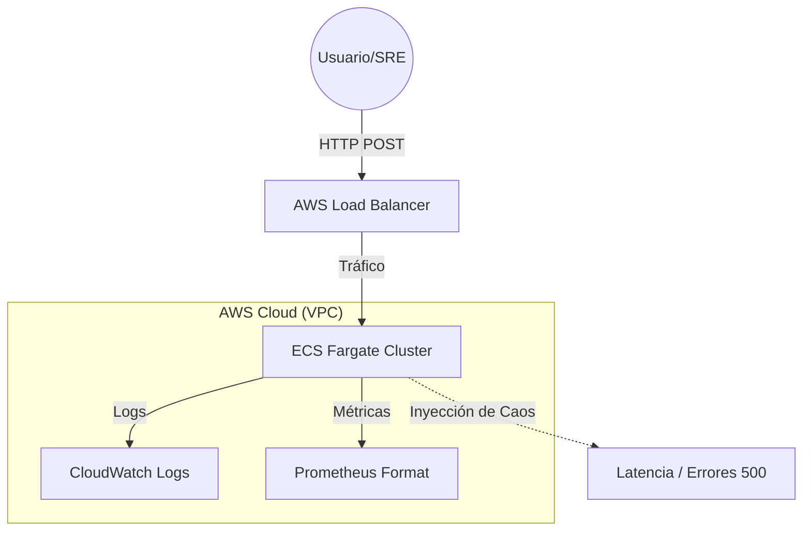

# 🧪 SRE Chaos Lab (AWS Edition)

[](https://github.com/tu-usuario/SRE-Chaos-Lab/actions)


Este repositorio es un **Laboratorio de Ingeniería de Fiabilidad (SRE)** diseñado para demostrar cómo construir, monitorear y estabilizar infraestructuras cloud-native bajo condiciones de fallo.

## 🏗️ Arquitectura del Sistema



## 🚀 Características Principales (SRE Focus)

*   **Infraestructura como Código (IaC):** Despliegue total en AWS usando Terraform (VPC, ECS, ECR).
*   **Observabilidad Nativa:** Instrumentación con `prometheus-fastapi-instrumentator` y exportación de logs a CloudWatch.
*   **Chaos Engineering Integrado:** Endpoints controlados para simular degradación de servicio:
    *   `POST /chaos/latency/toggle`: Inyecta latencia aleatoria (2-5s).
    *   `POST /chaos/errors/toggle`: Activa una tasa de error del 30% (Simulación de fallo de dependencia).
*   **CI/CD Profesional:** Pipeline en GitHub Actions que valida el Dockerfile y la sintaxis de Terraform antes de cada despliegue.

## 📊 SRE Signals (Las 4 Golden Signals)

Este laboratorio permite medir:
1.  **Latencia:** Monitoreo del impacto de la inyección de retrasos en el middleware.
2.  **Tráfico:** Conteo de peticiones procesadas por el cluster de Fargate.
3.  **Errores:** Visualización de picos de 5xx mediante el switch de caos.
4.  **Saturación:** Observación del uso de CPU/RAM en la consola de ECS.

## 🛠️ Ejecución Rápida

### Local (Docker)
```bash
docker build -t sre-chaos-app .
docker run -p 8000:8000 sre-chaos-app
```

### AWS (Terraform)
```bash
cd terraform
terraform init
terraform apply
```

---
*Este proyecto forma parte de mi camino hacia la maestría en SRE y observabilidad cloud.*
