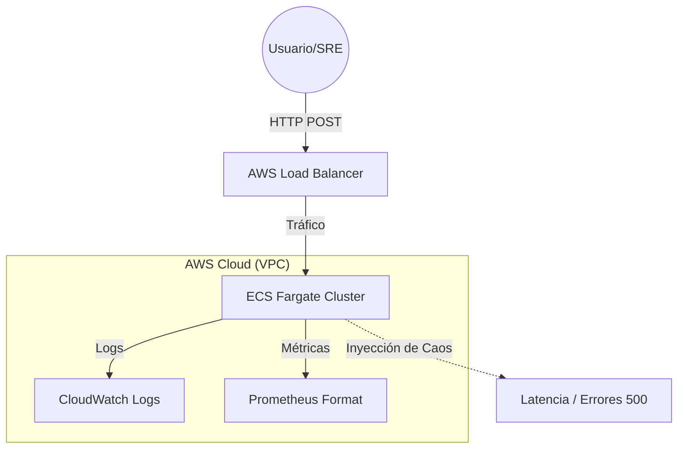

# 🧪 Cloud Reliability & Security Lab (AWS Edition)

[](https://github.com/VilAnlvil/Cloud-Reliability-Security-Lab/actions)


Este repositorio es un **Laboratorio de Ingeniería de Fiabilidad (SRE)** diseñado para demostrar cómo construir, monitorear y estabilizar infraestructuras cloud-native bajo condiciones de fallo.

## 🏗️ Arquitectura del Sistema



## 🚀 Características Principales (SRE Focus)

*   **Infraestructura como Código (IaC):** Despliegue total en AWS usando Terraform (VPC, ECS, ECR).
*   **Observabilidad Nativa:** Instrumentación con `prometheus-fastapi-instrumentator` y exportación de logs a CloudWatch.
*   **Estrategia de Observabilidad Dual:**
    *   **Local:** Stack Prometheus/Grafana para feedback rápido en desarrollo.
    *   **Cloud (AWS):** CloudWatch Logs y Métricas integradas mediante arquitectura nativa.
*   **Chaos Engineering Integrado:** Endpoints controlados para simular degradación de servicio:
    *   `POST /chaos/latency/toggle`: Inyecta latencia aleatoria (2-5s).
    *   `POST /chaos/errors/toggle`: Activa una tasa de error del 30% (Simulación de fallo de dependencia).
*   **CI/CD Profesional:** Pipeline en GitHub Actions que valida el Dockerfile y la sintaxis de Terraform antes de cada despliegue.

## 📊 SRE Signals (Las 4 Golden Signals)

Este laboratorio permite medir:
1.  **Latencia:** Monitoreo del impacto de la inyección de retrasos en el middleware.
2.  **Tráfico:** Conteo de peticiones procesadas por el cluster de Fargate.
3.  **Errores:** Visualización de picos de 5xx mediante el switch de caos.
4.  **Saturación:** Observación del uso de CPU/RAM en la consola de ECS.

## 🛠️ Ejecución Rápida

### Local (Docker / Podman)
```bash
# Con Docker
docker build -t sre-chaos-app .
docker run -p 8000:8000 sre-chaos-app

# Con Podman (Recomendado para SRE)
podman build -t sre-chaos-app .
podman run -d --name chaos-app -p 8000:8000 sre-chaos-app
```
> **Nota SRE:** En entornos Podman Rootless, si `localhost:8000` falla, utiliza `http://0.0.0.0:8000` o la IP de tu interfaz para saltar las limitaciones de la pila de red `slirp4netns`.

### AWS (Terraform)
```bash
cd terraform
terraform init
terraform apply
```

## 📑 Root Cause Analysis (RCA) & Postmortems

Un SRE senior no solo soluciona incidentes, sino que asegura que no se repitan. En este repositorio documento análisis detallados de vulnerabilidades y fallos de infraestructura:

*   **[RCA: MS17-010 (EternalBlue) & Hardening](./reports/MS17-010-RCA.md):** Análisis de explotación de SMBv1, troubleshooting de interoperabilidad Ruby/NTFS y automatización de remediación vía Ansible para cumplimiento **PCI DSS 4.0.1**.

## 🧪 Caos en Acción (Evidencias)

### 📈 Monitoreo de Latencia
En esta captura se observa el impacto inmediato de activar el switch de caos. La latencia media pasa de **~2ms** a **>3s**, simulando una degradación de red o saturación de base de datos.


### 🩺 Salud del Sistema (Self-Healing)
Registro de cómo Prometheus detecta el estado de salud de los targets en tiempo real.


---
**Ingeniería de Fiabilidad en acción.** Desarrollado bajo principios de **SRE & AWS Well-Architected**. Este laboratorio es una prueba continua de que la visibilidad y el diseño para el fallo son las bases de la infraestructura moderna. 🚀
