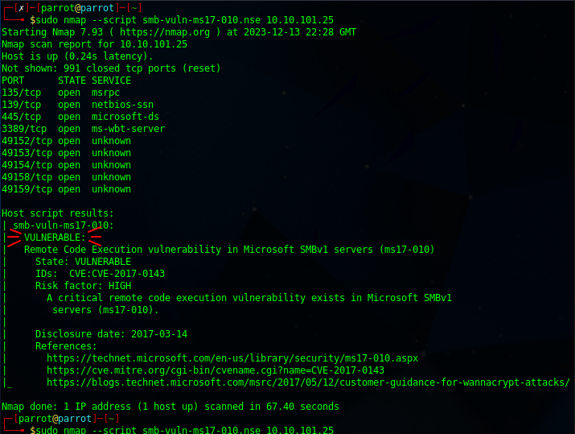
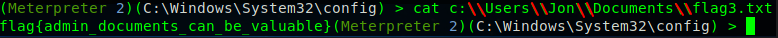
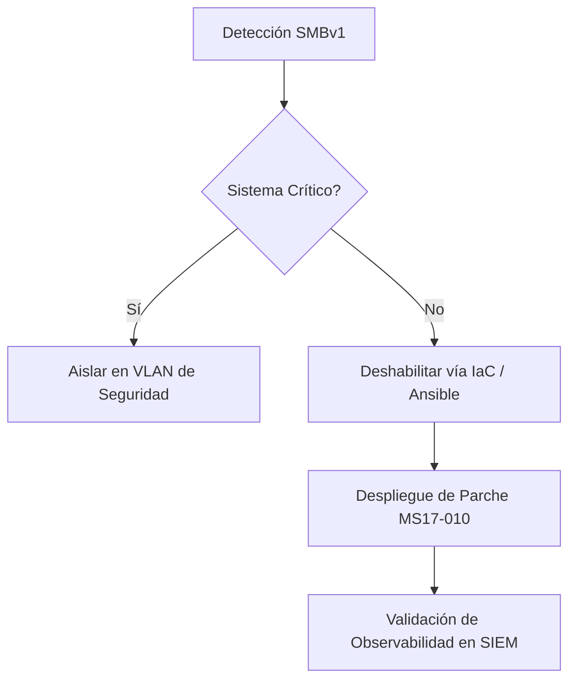

# Executive Summary

Este reporte técnico documenta el análisis de la vulnerabilidad **CVE-2017-0144 (EternalBlue)**. El objetivo primordial de esta investigación no es la explotación, sino la validación de la **resiliencia de infraestructura** y el diseño de estrategias de **Remediación Automatizada (Patch Management)**. 

Como SRE, este hallazgo se traduce en un riesgo crítico de **Continuidad de Negocio** y un incumplimiento de los controles de seguridad exigidos por **PCI DSS 4.0.1** (Requisito 6.3.2).

---

# 1. Diagnóstico de Infraestructura (Reconnaissance)

Durante la fase de diagnóstico de red, se priorizó la identificación de protocolos heredados (*Legacy*) que comprometen la estabilidad del stack de red.

### Análisis de Escaneo masivo
Utilizando `nmap`, se ejecutó un script de enumeración específico sobre el puerto TCP 445.

> [!NOTE]
> Strategic Insight
> Un SRE de Nivel 3 no solo busca "vulnerabilidades", sino que analiza cómo los protocolos ineficientes como **SMBv1** consumen recursos del kernel y exponen la superficie de ataque.



---

# 2. Análisis de Causa Raíz (Exploitation Phase)

La explotación exitosa confirma que el servicio `srv.sys` en el kernel de Windows falla al manejar paquetes malformados, permitiendo una ejecución de código remoto (RCE) con privilegios de **SYSTEM**.

### Troubleshooting de Interoperabilidad (Lección N3)
Durante la post-explotación mediante la shell Meterpreter, se identificó un fallo crítico de sintaxis al interactuar con el sistema de archivos NTFS.

**Análisis Técnico del Fallo:**
La shell, al estar compilada en **Ruby**, interpreta los *backslashes* (`\`) de Windows como caracteres de escape de Linux. 
* **Error observado:** `[-] stdapi_fs_stat: Operation failed`
* **Solución de Ingeniería:** Implementación de escape doble (`\\`) para normalizar la ruta.

> [!TIP]
> **Diferenciador Senior**
> Este incidente subraya la importancia de la **Interoperabilidad de Sistemas**. En un escenario de recuperación ante desastres (DR) mediante scripts de automatización (Python/Bash), no considerar estas discrepancias de lenguaje puede causar fallos masivos en la orquestación.



---

# 3. Plan de Remediación y Hardening (SRE Mindset)

Para alinear este hallazgo con los estándares de **PCI DSS 4.0.1**, se propone el siguiente flujo de remediación escalable:

### Flujo de Resolución Automatizada (Mermaid Diagram)


### Propuesta de Código: Hardening via Ansible

Para evitar el "Toil" de reparar servidor por servidor, se diseñó este playbook de remediación masiva:

```mermaid
graph LR
    subgraph CP [Control Plane - SRE Workstation]
        A[Ansible Playbook:<br/>Hardening_SMBv1.yml]
    end
    
    subgraph FI [Fleet Infrastructure - Target Nodes]
        A --> B(Windows Server 01)
        A --> C(Windows Server 02)
        A --> D(Windows Server N...)
    end
    
    subgraph AO [Automated Outcome]
        B --> B1{Status: Absent}
        C --> C1{Status: Absent}
        D --> D1{Status: Absent}
        B1 & C1 & D1 --> E[Result: Infrastructure Compliant]
    end

    style A fill:#4CAF50,stroke:#333,stroke-width:2px,color:#fff
    style E fill:#2196F3,stroke:#333,stroke-width:2px,color:#fff
    style CP fill:#f9f9f9,stroke:#666,stroke-dasharray: 5 5
    style FI fill:#f9f9f9,stroke:#666,stroke-dasharray: 5 5
    style AO fill:#f9f9f9,stroke:#666,stroke-dasharray: 5 5
 ```
    
# 4. Conclusiones y Cumplimiento

1. **Seguridad Proactiva:** La eliminación de SMBv1 no es solo una mejora de seguridad, es una optimización de la confiabilidad del sistema.
    
2. **Gobernanza:** Este proceso cumple con el control **PCI DSS 4.0.1** sobre la gestión de vulnerabilidades y el endurecimiento de configuraciones de sistema.
    


**Compliance & Standards**
Todos los reportes y playbooks en este portfolio están diseñados siguiendo los lineamientos de PCI DSS 4.0.1 y la Ley 21.663 (Marco de Ciberseguridad de Chile), priorizando la inmutabilidad y el endurecimiento de la infraestructura crítica.
